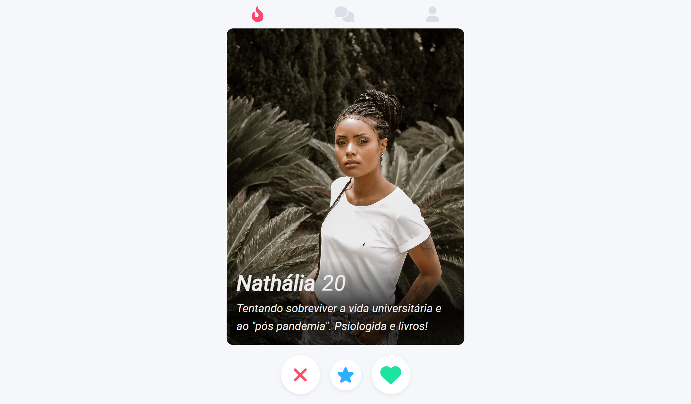

# Clone do Spotify

    Mais um projeto criado seguindo a aula do Felipe Rocha no início do bootcamp #GoDev da Ímã Learning Place.

[🔗 Clique aqui para acessar o projeto](https://igorlrlclonetinder.netlify.app/)

[🔗 Clique aqui para acessar a aula do Felipe Rocha](https://youtu.be/bLNar9fmtqk)

## 🛠 Tecnologias

- HTML
- CSS
- GIT
- GitHub
- Netlify

## 💬 Contato

Likedin: https://www.linkedin.com/in/igor-leandro-5a22531a2/